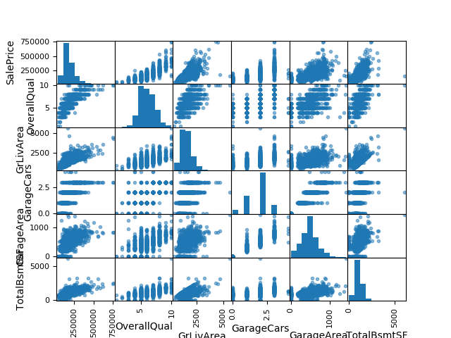
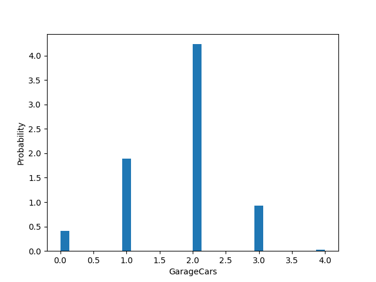

# Introdução

A proposta deste relatório é apresentar todo o caminho e desenvolvimento que foi necessário para analisar o *dataset House Prices: Advanced Regression Techniques*.

# Análise

Para a análise desse *dataset* foi necessário avaliação de cada *feature* com o objetivo de entender o conteúdo de cada caracteristia das csas e poder prever melhor o comportamento. Inicialmente, foi feito a análise utilizando a matriz de correlação, o objetivo é entender a relação de cada *feature* ao ponto de descartar as que era mais correlacionadas para não enviesar o modelo. A imagem a seguir ilustra a matriz de correlação:


Analisando a matriz de correlação percebemos que temos algumas características fortemente correlacionadas. Entre elas:

  * GarageYrBlt e YearBuilt - ambos representam datas de construção da garagem e o apartamento, respectivamente.
  * 1stFlrSF e TotalBsmtSF - representa a correlação entre a área do primeiro piso e a área total do porão.
  * TotRmsAbvGrd e GrLivArea - representa a correlação entre a quantidade de quartos de ouros andarea e a área acima do solo.
  * GaregeArea e GaregeCars - representa a correlação entre a área da garagem e a quantidade de carros que cabem na garagem.


Além disso, foi analisado os dados de cada coluna com o objetivo de entender quais que poderiam possuir valores vazios (NA), quais que possuiam valores numéricos e quais que deveria ser subistituidos por valores numéricos discretos ou continuos. Para isso foi utilizado a função abaixo:

```python
def analising_missing_values(dataset):
    analise = {}
    for col in xrange(len(dataset)-1):
        possible_values = set(dataset[col])
        analise[col] = {'possible_values': len(possible_values), 'na_percent': Decimal(0)}
        if 'NA' in list(possible_values):
            analise[col]['na_percent'] = Decimal(dataset[col].count('NA')) / Decimal(len(dataset[col]))
    return analise
```

Essa função faz a análise de cada coluna, vendo quais são os possiveis valores e a quantidade de valores faltantes (NA). Retorna um dicionário que contém a porcentagem de valores faltantes e quantidade de possiveis valores.

Foi gerado também a matriz de dispersão das features mais correlacionadas com o preço de venda dos imóveis:


Essa matriz pode ser usada para ver a disperão simultânea de cada caracteristica simultaneamente ao ponto de verificar como as distribuições são correlacionadas.

Também foram gerados distribuições das *features* mais correlacionadas com o preço de venda das casas, podendo assim ver de maneira mais detalhada cada uma delas. Podemos perceber, no geral, que elas a distribuíção respeita a distribuição normal:





# Preparação dos dados

Para a preparação dos dados foram utilizados três técnicas: *Hashing trick*, o preenchimento de dados vazios e a normalização dos dados.

Utilizando a função `analising_missing_values` podemos perceber um padrão e avaliar os parâmetros que seriam utilizados na função de *hashing_trick*.

A quantidade de possíveis valores para cada coluna foi utilizado na aplicação da técnica de *Hashing Trick*. Essa técnica é usada para trocar os valores de texto para valores numéricos sem alterar a correlação entre eles. Dado uma coluna, cria-se uma coluna nova para cada possibilidade existente, e paaa cada linha que possuia um daqueles valores, é trocada de 0 para 1 na coluna que presenta essa característica. Dessa forma, não cria uma relação de grandeza entre as características, o que ocorreria se trocassemos os valores de texto por númeoros ordenados. Dessa forma, o *dataset* antigo de 80 colunas de *features* passou a ter 520 colunas, e esse novo *dataset* gerado foi utilizado nos métodos de regressão.

O código abaixo representa a função de *hashing trick*:

```python
def hashing_trick(train_dataset, test_dataset, unique_values=20, cols_to_remove=[]):
    new_header = create_column(train_dataset)
    hashing_trick_columns = []
    for col in xrange(1,len(train_dataset) - 1):
        if len(set(train_dataset[col])) <= unique_values and col not in cols_to_remove:
            hashing_trick_columns.append(new_header[col])

    training_lines = len(train_dataset[0])
    test_lines = len(test_dataset[0])

    merged_dataset = np.concatenate((train_dataset[:-1], test_dataset), axis=1)

    data_frame = pd.DataFrame(data=np.transpose(merged_dataset), columns=new_header[:-1])

    for col in hashing_trick_columns:
        dummies = pd.get_dummies(data_frame[col])
        data_frame = pd.concat([data_frame, dummies], axis=1)
        data_frame.drop([col], inplace=True, axis=1)

    train_data_frame = pd.concat([data_frame[0:training_lines],
                                  pd.DataFrame(train_dataset[-1], columns=['salesPrice'])], axis=1)
    test_data_frame = data_frame[training_lines:]

    print(len(train_data_frame.columns))
    print(len(test_data_frame.columns))

    train_data_frame.to_csv('dataset/processed/trainWithHashTrick.csv', index = False, header=False)
    test_data_frame.to_csv('dataset/processed/testWithHashTrick.csv', index = False, header=False)
```

De maneira simples, a função avalia as possibilidades de cada coluna e caso seja menor que o parâmetro, essas colunas são trocas por dummies. No final, esse novo *dataset* é salvado em arquivo para que não seja necessário a rerodução do método para o desenvolvimento da regressão.

Além disso, foi utilizado a média de cada coluna para preencher os valores que eram faltantes, tomando o devido cuidado com as colunas que possuiam a possibilidade de dados faltantes representarem alguma informação relevante, como o caso 2ndFlrSF e Condition2 que poderiam ou não existirem. o Código abaixo representa a implementação dessa técnica:

```python
filled_train_df = train_df.fillna(train_df.mean())
```

E por fim, foi realizado a normalização de cada coluna de feature dos dados, como aponta o código abaixo:

```python
min_max_scaler = preprocessing.MinMaxScaler()
x_saled = min_max_scaler.fit_transform(x)
filled_train_df = pd.DataFrame(x_scaled)
```

# Algoritmos de Regressão e Treinamento

Para a avaliação desse trabalho foram usados diversos algoritmos de regressão com o objetivo de encontrar um modelo que consiga diminuir o erro em relação ao resultado calculado e o real. Entre eles temos :
Regressão Linear, Ridge, Lasso, Lars, *Orthogonal Matching Pursuit*, *Bayesian Ridge*, *Gradient Boost*, *Random Forest* e por fim *Ada Boost*.

Para cada modelo utilizado, foram usados a técnica de falidação cruzada e e *Kfold*. Ambas as técnicas são usadas para melhorar o desempenho do treinamento e dessa forma promover melhores resultados. O código abaixo ilustra como as técniacs foram utilizadas:

```python
def fit_models(features, target, test_df, num_folds, test_size=.2, save=False):
    results = {}
    for i, model in enumerate(get_regression_models()):
        m = model[1]
        kfold = KFold(n_splits=num_folds)
        result = cross_val_score(m, features, target, cv=kfold)
        m.fit(features, target)
        predicted = m.predict(test_df)
        pred_df = pd.DataFrame(np.transpose(predicted), columns=['SalePrice'])\
                    .rename(index={x: x + 1461 for x in range(len(predicted))})
        pred_df.index.name = 'Id'
        if save:
            pred_df.to_csv('dataset/prediction/predict{}.csv'.format(model[0]), header=True)
        results[model[0]] = {
            'score': result.copy(),
            'score_mean': np.mean(result),
            'predict': pred_df.copy()
        }
    return results
```

O *Kfold*, utilizado acima, retorna os índices dos itens que usados para teste e treino fazendo assim uma seleção e mistura dos dados. Como paramêtro foi passado somente a quantidade de combinações dos dados para teste e treino. Esses *folds* foram usados na função *cross_val_score* que utiliza a técnica de validação cruzada e retorna uma nota que representa a avaliação da validação cruzada. Como o parâmetro dessa função foram passados o modelo, as *features* tratadas como descrito acima, *target* que representa a coluna de *SalePrice* do *dataset* de treinamento e por fim os índices que serão usados para treinamento e teste. A variável 'result' recebe uma lista com 10 avaliações que foram feitas para cada *fold* que foram usadas como base para a decisão do melhor modelo para o *dataset*.

## tabela de resultados

A tabela de resultados abaixo é a avaliação de cada modelo para cada *fold* realizado pelo metodo *cross_val_score* Podemos perceber que entre eles, tivemos um desempenho melhor dos modelos de *Gradient Boost*, *Random Forest* e *Bayesian Ridge*, com um destaque maior para o primeiro que teve uma média de avaliação de 0.8770437653896043.

| Fold | 1               | 2               | 3               | 4               | 5               |
|------|-----------------|-----------------|-----------------|-----------------|-----------------|
| AB   | 0.78506898      | 0.81426123      | 0.81454807      | 0.64364507      | 0.81458887      |
| LA   | -1.08158543e+73 | -1.77269963e+52 | -9.57560286e+37 | -4.53991633e+14 | -3.10037499e+39 |
| Lo   |  0.87192173     | 0.90969565      | 0.89872808      | 0.72510226      | 0.89084769      |
| RF   | 0.86697293      | 0.85274094      | 0.84643701      | 0.67719027      | 0.84540046      |
| LR   | 0.86723811      | 0.88801362      | 0.91278184      | 0.72440244      | 0.89142096      |
| GB   | 0.89075798      | 0.88941048      | 0.8633984       | 0.74449904      | 0.89715311      |
| BR   | 0.89748324      | 0.90737767      | 0.8776898       | 0.75672072      | 0.89329666      |
| R    | 0.88979644      | 0.91288842      | 0.89600697      | 0.74449146      | 0.89085991      |
| OMP  | 0.89124489      | 0.92423339      | 0.93404012      | 0.71609474      | 0.91132478      |


| Fold | 6               | 7               | 8               | 9               | 10              |
|------|-----------------|-----------------|-----------------|-----------------|-----------------|
| AB   | 0.82145989      | 0.79623606      | 0.73910663      | 0.7784952       | 0.76311893      |
| LA   | -3.58806819e+36 | -8.51106846e+67 | -2.30675821e+54 | -5.75285594e+48 | -1.29257427e+51 |
| Lo   | 0.642747        | 0.86642567      | 0.88962677      | 0.48865479      | 0.85208643      |
| RF   | 0.88283748      | 0.86834124      | 0.87146545      | 0.76239102      | 0.85933532      |
| LR   | 0.64079842      | 0.86464072      | 0.88933797      | 0.40409366      | 0.79675697      |
| GB   | 0.88414065      | 0.89379331      | 0.93757344      | 0.87855912      | 0.89115213      |
| BR   | 0.8833572       | 0.87706995      | 0.88616824      | 0.5767759       | 0.88942955      |
| R    | 0.83364692      | 0.89085991      | 0.88795322      | 0.51532244      | 0.8648772       |
| OMP  | 0.68125843      | 0.88698         | 0.90876031      | 0.56701896      | 0.88000898      |

Dessa maneira, o *Gradient Boost* foi escolhido como modelo principal e por conta disso, foram feitos diversos testes mudando os parâmetros do modelo até encontra um que melhorasse ainda mais o desempenho do modelo. os parâmetros passados foram:

```python
ensemble.GradientBoostingRegressor(alpha=0.9, criterion='friedman_mse', init=None, learning_rate=0.1,
                                   loss='ls', max_depth=5, max_features=None, min_samples_leaf=1,
                                   min_samples_split=2, min_weight_fraction_leaf=.0, n_estimators=400,
                                   presort='auto', random_state=None, subsample=1.0, verbose=0,
                                   warm_start=False)
```
Com esses parâmetros foi possível melhorar significativamente a posição no Kaggle, saindo de 4083, como o modelo simples de Regressão Linear, para 2358 com o *Gradient Boost*.
